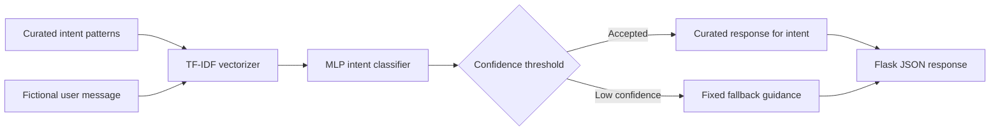
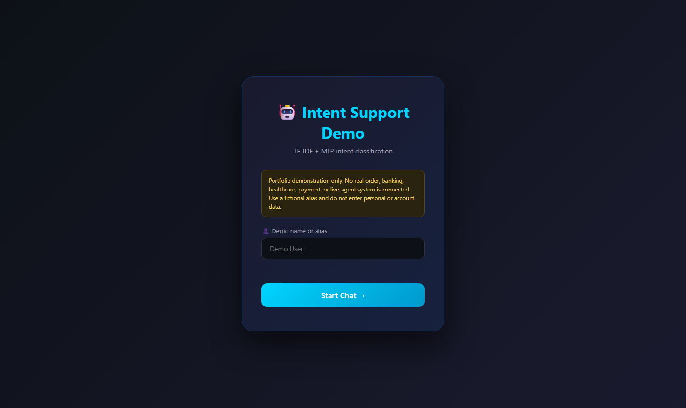
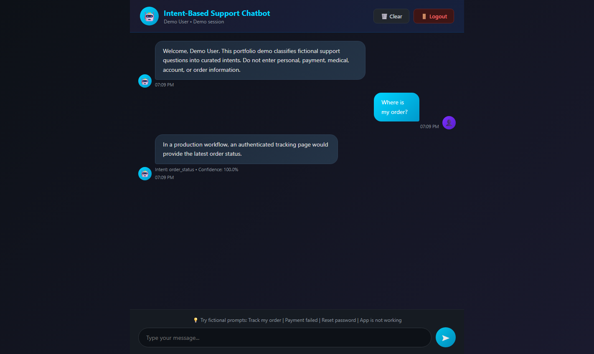
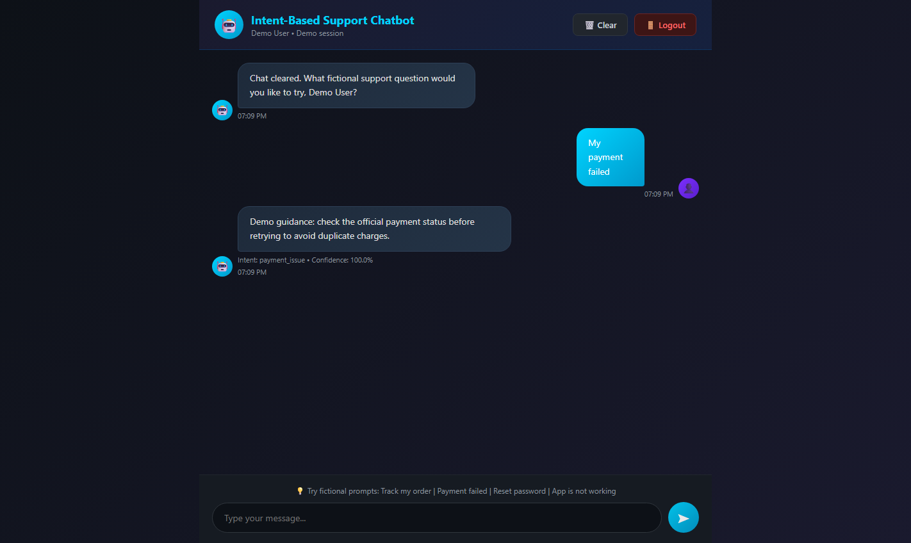

# AI Chatbot Python — Intent-Based Support Assistant

A privacy-safe Flask portfolio application that classifies fictional support questions with TF-IDF features and a scikit-learn multilayer perceptron (MLP), then selects a response from a curated intent catalog.

This is a small supervised NLP demonstration—not a generative-AI system, LLM, production support bot, or connection to any real organization.

## What it demonstrates

- loading and validating a JSON intent catalog;
- training a deterministic TF-IDF + MLP intent classifier at application startup;
- returning the predicted intent, a confidence estimate, and a curated response;
- applying a confidence threshold and fixed fallback for unclear text;
- exposing the classifier through validated Flask JSON routes;
- rendering user and bot text with safe DOM text nodes rather than HTML interpolation;
- automated model, data, route, and privacy-boundary tests.

## Technology stack

- Python 3.10+
- Flask
- scikit-learn
- HTML, CSS, and vanilla JavaScript
- pytest

## Workflow



The model is trained from `intents.json` when the app starts. No model binary is stored, no external API is called, and no conversation is written to a database or log by the application.

## Intent catalog

The catalog currently contains 18 demonstration intents and 198 training phrases across topics such as greetings, order status, payments, password reset, basic app troubleshooting, and appointment questions. Responses are original demo text and explicitly avoid claiming that real transactions, bookings, card actions, or escalations occur.

## Installation

```powershell
python -m venv .venv
.\.venv\Scripts\Activate.ps1
python -m pip install -r requirements.txt
```

For development and tests:

```powershell
python -m pip install -r requirements-dev.txt
python -m pytest
```

## Run locally

```powershell
python app.py
```

Open `http://127.0.0.1:5000`. Use a fictional alias and fictional questions only. A temporary random Flask session key is generated automatically for local use. To provide your own development key, set `FLASK_SECRET_KEY` in your shell; do not commit the value.

## Example interactions

| Fictional input | Expected intent | Behavior |
|---|---|---|
| `Where is my order?` | `order_status` | Explains that no real order lookup exists |
| `My payment failed` | `payment_issue` | Gives safety-oriented demo guidance |
| `Reset my password` | `reset_password` | Points to an official reset flow without requesting credentials |
| `App is not working` | `app_issue` | Provides cautious troubleshooting guidance |
| unrelated text | model prediction below threshold | Returns the fixed fallback |

## Screenshots

### Safe-entry screen



### Order-status intent



### Payment-safety intent



All screenshots use fictional inputs and contain no personal or account information.

## Project structure

```text
app.py                         Flask routes and application factory
chatbot.py                     intent loading, TF-IDF, MLP, prediction
intents.json                   curated fictional training phrases/responses
templates/index.html           browser interface
notebooks/intent_chatbot_demo.ipynb
tests/                         classifier and route tests
docs/                          architecture, provenance, LinkedIn, interview notes
screenshots/                   privacy-safe demo captures
requirements*.txt              runtime and development dependencies
```

## Testing

The test suite covers catalog validation and counts, representative intent predictions, low-confidence fallback behavior, safe response-content rules, Flask routes, and malformed inputs.

Passing tests confirm the checked scenarios only. The project does not claim a general accuracy score because the small curated phrase catalog does not provide an independent representative evaluation dataset.

## Limitations

- The MLP is trained on a small hand-authored catalog at startup.
- Confidence is a class probability estimate, not proof that a response is correct.
- Unseen phrasing can be misclassified.
- There is no context tracking, retrieval, generative response, multilingual support, authentication, persistence, external API, or human-agent handoff.
- The Flask development server is for local demonstration only.

## Future improvements

- create a separately reviewed validation set and report per-intent precision/recall;
- add calibration and an explicit out-of-scope detector;
- separate model training from serving and version the approved artifact;
- add rate limiting, CSRF strategy, structured monitoring, and production WSGI deployment;
- evaluate a retrieval or LLM-assisted design with strict data, prompt, safety, and cost controls.

## License

The original source and documentation in this repository are available under the [MIT License](LICENSE), copyright 2026 Manjunath S Vernekar. Third-party libraries retain their own licenses.

## Author

Manjunath S Vernekar
